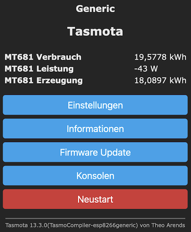
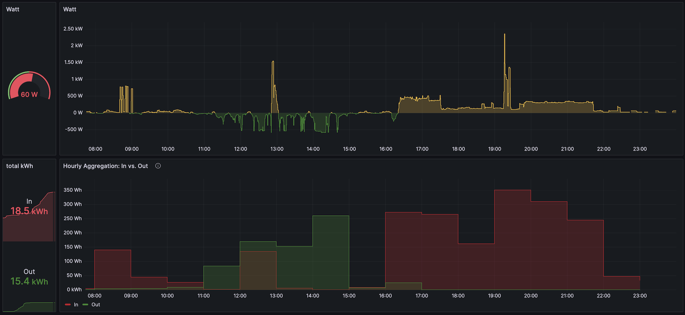

# Read out electricity meter Iskra MT681 (Stromzähler)

## Motivation

After installing 2 photovoltaic modules on my balcony (check out the [project documentation](https://entorb.net/wickie/Balkonkraftwerk)), my electricity provider unfortunately replaced my old electricity meter (that rotated backwards when PV production exceeded my consumption).

As the new meter has an optic interface, I decided to try to read it out to have at least some benefit of the replacement...

A [great documentation](https://ottelo.jimdofree.com/stromz%C3%A4hler-auslesen-tasmota/) (in German) on how to read out different electricity meters was my starting point.

## Hardware

My electricity meter is an Iskra eHZ-MT681-D4A52-K0p

For the readout I bought an [all-inclusive product](https://www.wispr-shop.de/produkt/wifi-ir-schreib-lesekopf-diy-set/) for 40€ at eBay. It bundles

* Hichi IR sensor
* micro controller ESP01S (Wi-Fi and MicroUSB power connector)
* pre-installed software Tasmota V13.3

So no Arduino programming and no soldering ;-)

## Setup

Following the manual of the sensor I performed these steps

* connect laptop to sensor's Wi-Fi
* enter my Wi-Fi credentials
* switch back to my Wi-Fi
* access sensor webinterface
* setup the electricity meter via console -> script (see below)
* activating the script
* -> data appears on the main page of the UI
* set Logging->TelePeriod to 15 for readout every 15s
* (optionally) configure access to my MQTT server

### Tasmota script for Iskra MT681-D4A52-K0p

* copied from [Tasmota documentation](https://tasmota.github.io/docs/Smart-Meter-Interface/#iskra-ehz-mt681-d4a52-k0p)
* skipping/commenting out the last line of the static Meter_id

```text
>D
>B
=>sensor53 r
>M 1
+1,3,s,0,9600,MT681
1,77070100010800ff@1000,Verbrauch,kWh,Total_in,4
1,77070100100700ff@1,Leistung,W,Power_cur,0
1,77070100020800ff@1000,Erzeugung,kWh,Total_out,4
; 1,77070100000009ff@#,Service ID,,Meter_id,0|
```

### Set timezone

see [doc](https://tasmota.github.io/docs/Commands/#control)
in webinterface open console to read and change the timezone
`TimeZone` show current timezone
`TimeZone 99` use timezone configured by TimeDst and TimeStd

[tasmotatimezone.com](https://tasmotatimezone.com/) provides more info, in my case it suggests this command
`Backlog Latitude 49.5928616; Longitude 11.0056; TimeDST 0,0,3,1,1,120; TimeSTD 0,0,10,1,1,60; TimeZone 99`

## Data visualization

### In device webinterface

[Here](https://ottelo.jimdofree.com/stromz%C3%A4hler-auslesen-tasmota/) is described, how to upload a Tasmota firmware and script, that provides data visualization on the webinterface of the device. I did not try that.



### In Grafana

Instead, I use some existing pieces of software on a Raspberry Pi 3b "server".

* activate MQTT protocol in the sensor webinterface to send the data
* Python script to receive the data via MQTT
* InfluxDB to store the data
* Grafana to visualize the data



See [example_code](example_code) for Python example and Grafana dashboard model.

### In HomeAssistant

Alternative setup could be to use HomeAssistant to receive the data via MQTT, with is also described in the [HowTo](https://ottelo.jimdofree.com/stromz%C3%A4hler-auslesen-tasmota/).

## Tasmota commands via MQTT

see [Tasmota documentation](https://tasmota.github.io/docs/Commands/)

Sending an empty message body, results in the device responding with its current value.

```sh
mosquitto_pub -u mqtt_user -P mqtt_passwd -t "cmnd/tasmota_MT681/webserver" -m ""
```

## Power Saving

### Disable webinterface

After setting up the device and connecting to MQTT broker, I decided to turn off the webinterface, to hopefully reduce the power consumption. (here tasmota_MT681 is the name of my device)

```sh
mosquitto_pub -u mqtt_user -P mqtt_passwd -t "cmnd/tasmota_MT681/webserver" -m "0"
```

### Sending frequency

Reduce the devices sending frequency to every 300s

```sh
mosquitto_pub -u mqtt_user -P mqtt_passwd -t "cmnd/tasmota_MT681/TelePeriod" -m "300"
```

Since attaching the device to a power source, instead of a power bank (see below), I use 10s during the day and 30s in the night. Switching is triggered via crontab of my raspi.

### Sleep and Dynamic Sleep

see [Tasmota Energy-Saving docu](https://tasmota.github.io/docs/Energy-Saving/) on Sleep vs. Dynamic Sleep
(currently I use default Dynamic Sleep and 50ms)

set longer sleep time of 200ms (default is 50)

```sh
mosquitto_pub -u mqtt_user -P mqtt_passwd -t "cmnd/tasmota_MT681/Sleep" -m "200"
```

Switch from Dynamic Sleep (0) to normal Sleep (1)

```sh
mosquitto_pub -u mqtt_user -P mqtt_passwd -t "cmnd/tasmota_MT681/SetOption60" -m "1"
```

## Power Supply

Since I had no power plug in the meter cabinet available, I used an USB power bank. Unfortunately, that one only lasted for a couple of days, despite my power saving efforts. So I installed a 5V power source [MEAN WELL HDR-15-5](https://www.meanwell-web.com/en-gb/ac-dc-ultra-slim-din-rail-power-supply-input-range-hdr--15--5) behind a new fuse in the meter cabinet.
